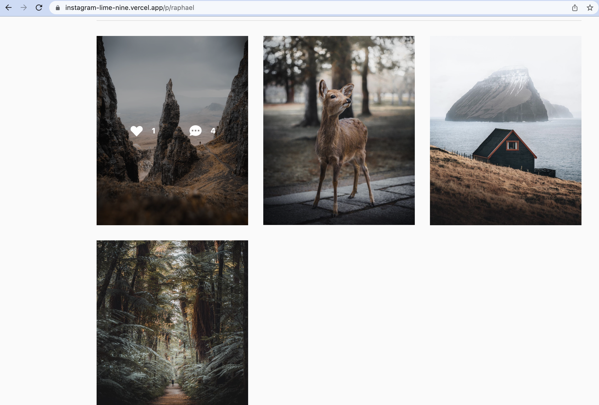
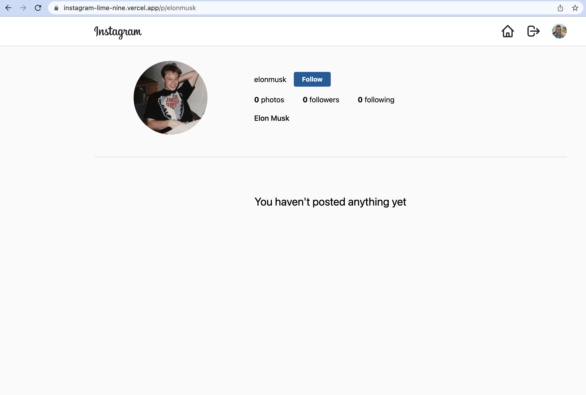

# Instagram

## Project Description

An Instagram clone using React, Tailwind CSS and Firebase. The following pages have been built within the application: login, sign up, dashboard and user profile page. Firebase and firestore handles all the data, and the data is retrieved using a custom hook.

Tailwind CSS is used in this projects, was painfull and enjoyable at the same time :) 

Project is available to be viewed https://instagram-lime-nine.vercel.app/ and the code is https://github.com/aiefymenko/instagram

## Screenshots

Dashboard (Home page)

Prodile Page (with posts)

Empty profile

Sign Up Page

